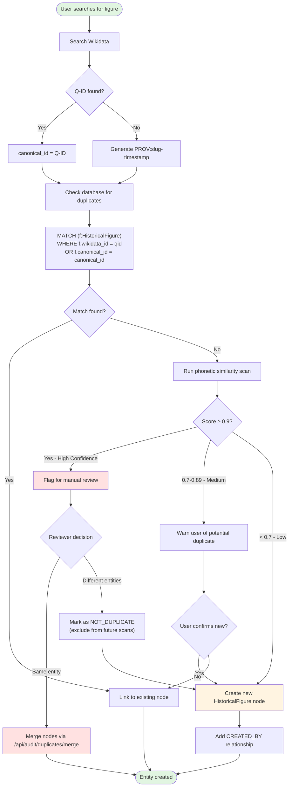

# Entity Resolution Protocol

**Status**: Active
**Version**: 2.0 (January 2026)
**Scope**: HistoricalFigure and FictionalCharacter nodes

---

## Overview

The Entity Resolution Protocol defines how Fictotum identifies, deduplicates, and canonicalizes historical figures to prevent duplicate entries. This protocol uses a **Wikidata-First** strategy combined with enhanced phonetic matching to ensure high-quality, globally unique identifiers.

**Key Principles**:
1. Wikidata Q-IDs are canonical identifiers when available
2. Provisional IDs (timestamped) are used only when Q-IDs don't exist
3. Dual-key blocking prevents duplicates via Q-ID or canonical_id match
4. Phonetic + lexical matching catches spelling variations

---

## Table of Contents

1. [Canonical ID Strategy](#canonical-id-strategy)
2. [Duplicate Prevention Workflow](#duplicate-prevention-workflow)
3. [Phonetic Matching Algorithm](#phonetic-matching-algorithm)
4. [Edge Cases and Solutions](#edge-cases-and-solutions)
5. [Migration Path](#migration-path)
6. [Common Pitfalls](#common-pitfalls)

---

## Canonical ID Strategy

### Priority 1: Wikidata Q-ID

**When to use**: Always, if a Wikidata Q-ID exists for the figure.

**Format**: The exact Q-ID as a string (e.g., `"Q517"`)

**Example**:
```cypher
CREATE (f:HistoricalFigure {
  canonical_id: "Q517",           // ← Wikidata Q-ID
  wikidata_id: "Q517",            // ← Duplicate for redundancy
  name: "Napoleon Bonaparte",
  birth_year: 1769,
  death_year: 1821
})
```

**Why Q-IDs are canonical**:
- Globally unique across all of Wikidata (billions of entities)
- Stable over time (Q-IDs never change, even if labels change)
- Enables alignment with external knowledge bases
- Reduces research burden (Wikidata already resolved the entity)

**Verification Process**:
1. Search [Wikidata](https://www.wikidata.org) for the figure's name
2. Verify the Q-ID matches your intended figure (check birth/death years, occupations)
3. Copy the Q-ID (format: `Q` followed by digits, no spaces)
4. Use this Q-ID for BOTH `canonical_id` and `wikidata_id` properties

---

### Priority 2: Provisional ID

**When to use**: Only when **no Wikidata Q-ID exists** after thorough search.

**Format**: `PROV:{slug}-{timestamp}`

**Example**:
```cypher
CREATE (f:HistoricalFigure {
  canonical_id: "PROV:john-smith-1738462847293",  // ← Provisional ID
  name: "John Smith",
  birth_year: 1650,
  death_year: 1720,
  conflict_flag: "no_wikidata_qid",
  conflict_notes: "No Q-ID found despite search on 2026-02-01; potentially obscure local figure"
})
```

**Components**:
- **PROV:** prefix - Signals that this is a provisional identifier
- **slug** - Lowercase, hyphen-separated name (e.g., `john-smith`)
- **timestamp** - Unix timestamp in milliseconds (prevents collisions)

**Why timestamps are critical**:
- Multiple figures can have identical names (e.g., "John Smith")
- Without timestamps, `PROV:john-smith` would create duplicates
- Timestamp ensures global uniqueness: `PROV:john-smith-1738462847293` ≠ `PROV:john-smith-1738462999999`

**Generation Logic** (for agents):
```typescript
function generateProvisionalId(name: string): string {
  const slug = name.toLowerCase().replace(/\s+/g, '-').replace(/[^a-z0-9-]/g, '');
  const timestamp = Date.now();
  return `PROV:${slug}-${timestamp}`;
}

// Example:
generateProvisionalId("John Smith")
// Returns: "PROV:john-smith-1738462847293"
```

**When to flag for future Q-ID lookup**:
- Add `conflict_flag: "no_wikidata_qid"` to the node
- Document search attempts in session notes
- Periodically re-search Wikidata for newly added entities

---

## Duplicate Prevention Workflow

### Visual Flowchart



---

### Dual-Key Blocking Query

**Purpose**: Prevent duplicates by checking BOTH `wikidata_id` AND `canonical_id` before creating a new figure.

**Cypher Query**:
```cypher
MATCH (f:HistoricalFigure)
WHERE f.wikidata_id = $qid OR f.canonical_id = $canonical_id
RETURN f
```

**Parameters**:
- `$qid` - The Wikidata Q-ID (or null if not available)
- `$canonical_id` - Either the Q-ID or the generated PROV:slug-timestamp

**Logic**:
1. If Q-ID is provided → Check if any figure already has this Q-ID
2. If canonical_id is provided → Check if any figure already has this exact canonical_id
3. If EITHER matches → Do NOT create a new figure; link to the existing one

**Example Scenarios**:

**Scenario 1: Q-ID Match Prevents Duplicate**
```cypher
// Existing figure in database:
(:HistoricalFigure {canonical_id: "Q517", wikidata_id: "Q517", name: "Napoleon Bonaparte"})

// User tries to add "Napoleon I of France" with Q-ID Q517:
// Query detects: f.wikidata_id = "Q517" → Match found!
// Action: Link to existing node instead of creating duplicate
```

**Scenario 2: Canonical ID Match Prevents Duplicate**
```cypher
// Existing figure in database:
(:HistoricalFigure {canonical_id: "PROV:john-smith-1738400000000", name: "John Smith"})

// User tries to add "John Smith" again:
// Generated canonical_id: "PROV:john-smith-1738462999999" (different timestamp)
// Query detects: No wikidata_id match, no canonical_id exact match
// Action: Proceed to phonetic check (next step)
```

---

## Phonetic Matching Algorithm

### Overview

Fictotum uses **enhanced similarity scoring** that combines:
- **70% Lexical (Levenshtein Distance)**: Exact spelling similarity
- **30% Phonetic (Double Metaphone)**: Pronunciation similarity

**Why both?**
- Lexical catches typos and minor variations ("Napoleon" vs "Napolean")
- Phonetic catches pronunciation equivalents ("Smyth" vs "Smith", "Steven" vs "Stephen")
- Weighted combination prevents false positives (e.g., "Paris" vs "Pierce" have similar phonetics but low lexical match)

---

### Algorithm Details

**Implementation**: `web-app/lib/wikidata.ts` → `enhancedNameSimilarity()`

**Function Signature**:
```typescript
function enhancedNameSimilarity(name1: string, name2: string): {
  combined: number;   // Weighted average (0.0 - 1.0)
  lexical: number;    // Levenshtein similarity (0.0 - 1.0)
  phonetic: number;   // Double Metaphone similarity (0.0 - 1.0)
}
```

**Calculation**:
```typescript
// 1. Compute lexical similarity (Levenshtein distance)
const lexicalSimilarity = levenshteinSimilarity(name1, name2);

// 2. Compute phonetic similarity (Double Metaphone)
const phonetic1 = doubleMetaphone(name1);  // Returns [primary, alternate]
const phonetic2 = doubleMetaphone(name2);
const phoneticSimilarity = (
  phonetic1.primary === phonetic2.primary ||
  phonetic1.primary === phonetic2.alternate ||
  phonetic1.alternate === phonetic2.primary
) ? 1.0 : 0.0;

// 3. Weighted combination
const combined = (0.7 * lexicalSimilarity) + (0.3 * phoneticSimilarity);

return { combined, lexical: lexicalSimilarity, phonetic: phoneticSimilarity };
```

---

### Confidence Thresholds

| Combined Score | Confidence | Meaning | Action |
|----------------|-----------|---------|--------|
| ≥ 0.9 | **High** | Very likely duplicates | **Flag for manual review** |
| 0.7 - 0.89 | **Medium** | Possible duplicates | **Warn user before creation** |
| < 0.7 | **Low** | Unlikely duplicates | **Proceed with creation** |

**Additional Validation**:
- **Wikidata Q-ID Conflict Prevention**: If two figures have **different** Q-IDs, they are NOT duplicates (even with high name similarity)
- **Year Matching**: Birth/death year within ±5 years increases confidence
- **Soft-Deleted Exclusion**: Deleted nodes (`:Deleted` label) are excluded from duplicate scans

---

### Example Comparisons

**Example 1: High Lexical + High Phonetic = Definite Duplicate**
```typescript
enhancedNameSimilarity("Napoleon Bonaparte", "Napoleon Bonaparte")
// Returns: { combined: 1.0, lexical: 1.0, phonetic: 1.0 }
// Confidence: High → Flag for review
```

**Example 2: Spelling Variation (High Lexical, High Phonetic)**
```typescript
enhancedNameSimilarity("Steven", "Stephen")
// Returns: { combined: 0.85, lexical: 0.71, phonetic: 1.0 }
// Weighted: (0.7 * 0.71) + (0.3 * 1.0) = 0.797 + 0.3 = 0.85
// Confidence: Medium → Warn user
```

**Example 3: Pronunciation Equivalent (Low Lexical, High Phonetic)**
```typescript
enhancedNameSimilarity("Smyth", "Smith")
// Returns: { combined: 0.56, lexical: 0.6, phonetic: 1.0 }
// Weighted: (0.7 * 0.6) + (0.3 * 1.0) = 0.42 + 0.3 = 0.72
// Confidence: Medium → Warn user
```

**Example 4: Completely Different Names (Low Lexical, Low Phonetic)**
```typescript
enhancedNameSimilarity("Napoleon Bonaparte", "Julius Caesar")
// Returns: { combined: 0.15, lexical: 0.2, phonetic: 0.0 }
// Confidence: Low → Proceed
```

**Example 5: False Positive Prevention (Q-ID Conflict)**
```typescript
// Figure 1: Titus (Q1421) - Roman Emperor
// Figure 2: Titus (Q1418) - Different historical figure
enhancedNameSimilarity("Titus", "Titus")
// Returns: { combined: 1.0, lexical: 1.0, phonetic: 1.0 }
// BUT: Different Q-IDs (Q1421 ≠ Q1418)
// Action: NOT flagged as duplicate (Q-ID conflict prevention)
```

---

## Edge Cases and Solutions

### Edge Case 1: Unicode and Diacritics

**Problem**: "José" vs "Jose" should match, but different Unicode normalization can cause false negatives.

**Solution**: Normalize strings to NFD (Canonical Decomposition) before comparison.

```typescript
function normalizeForComparison(name: string): string {
  return name
    .normalize('NFD')                     // Decompose diacritics
    .replace(/[\u0300-\u036f]/g, '')      // Remove diacritical marks
    .toLowerCase();                       // Case-insensitive
}

// Example:
normalizeForComparison("José") === normalizeForComparison("Jose")  // true
```

**Implementation**: Already handled in `enhancedNameSimilarity()` preprocessing.

---

### Edge Case 2: Titles and Honorifics

**Problem**: "Emperor Napoleon" vs "Napoleon Bonaparte" vs "Napoleon I of France" should all match.

**Solution**: Strip titles before comparison.

```typescript
const titles = [
  'emperor', 'king', 'queen', 'prince', 'princess', 'duke', 'count',
  'sir', 'lady', 'lord', 'dr', 'professor', 'president', 'general'
];

function stripTitles(name: string): string {
  let cleaned = name.toLowerCase();
  titles.forEach(title => {
    cleaned = cleaned.replace(new RegExp(`\\b${title}\\b`, 'gi'), '');
  });
  return cleaned.trim();
}

// Example:
stripTitles("Emperor Napoleon")  // "Napoleon"
stripTitles("Napoleon I of France")  // "Napoleon of France"
```

**Implementation**: Applied in `enhancedNameSimilarity()` preprocessing.

---

### Edge Case 3: Multi-Word Names

**Problem**: "Simón Bolívar" vs "Simón José Antonio de la Santísima Trinidad Bolívar Palacios Ponte y Blanco" (full name)

**Solution**: Compare both full name AND last name only.

```typescript
function extractLastName(name: string): string {
  const parts = name.trim().split(/\s+/);
  return parts[parts.length - 1];  // Last word
}

// Compare both:
const fullNameSimilarity = enhancedNameSimilarity(name1, name2);
const lastNameSimilarity = enhancedNameSimilarity(
  extractLastName(name1),
  extractLastName(name2)
);

// If last name matches highly, flag for review
if (lastNameSimilarity.combined >= 0.9) {
  // Potential match (same family)
}
```

**Implementation**: Future enhancement (not yet implemented).

---

### Edge Case 4: Historical vs Fictional Characters

**Problem**: "Robin Hood" (historical?) vs "Robin Hood" (fictional character in a specific work)

**Solution**: Use separate node types and check both.

```cypher
// Check for both HistoricalFigure AND FictionalCharacter
MATCH (f)
WHERE (f:HistoricalFigure OR f:FictionalCharacter)
  AND (f.wikidata_id = $qid OR f.canonical_id = $canonical_id)
RETURN f
```

**Decision Tree**:
1. If Wikidata categorizes as "fictional human" → Create FictionalCharacter
2. If Wikidata categorizes as "human" → Create HistoricalFigure
3. If disputed → Use `conflict_flag: "historicity_disputed"` and create HistoricalFigure with `historicity: "Disputed"`

---

### Edge Case 5: Same Name, Different Eras

**Problem**: "Cleopatra" (multiple Egyptian queens named Cleopatra)

**Solution**: Check birth/death years during duplicate detection.

```typescript
function yearMatch(year1: number | null, year2: number | null, tolerance = 5): boolean {
  if (!year1 || !year2) return false;  // Can't verify without years
  return Math.abs(year1 - year2) <= tolerance;
}

// Enhanced duplicate detection:
if (nameSimilarity.combined >= 0.9) {
  // High name similarity, check years
  if (yearMatch(figure1.birth_year, figure2.birth_year)) {
    // Same name + similar birth year = likely duplicate
    flagForReview();
  } else {
    // Same name + different era = likely different people
    allowCreation();
  }
}
```

**Example**:
```cypher
// Cleopatra VII (Q635)
(:HistoricalFigure {canonical_id: "Q635", name: "Cleopatra", birth_year: -69, death_year: -30})

// Cleopatra II (Q40834)
(:HistoricalFigure {canonical_id: "Q40834", name: "Cleopatra", birth_year: -185, death_year: -116})

// Name similarity: 1.0 (identical)
// Birth year difference: |-69 - (-185)| = 116 years
// Action: NOT flagged as duplicate (different eras)
```

---

## Migration Path

### Existing Figures with Old Canonical IDs

**Problem**: Figures created before January 2026 may have canonical IDs like `"napoleon-bonaparte"` (slug only, no `PROV:` prefix).

**Solution**: Run the migration script to prefix all slug-only IDs.

**Migration Script**: `scripts/migration/prefix_provisional_canonical_ids.py`

**Usage**:
```bash
# Dry-run (preview changes)
python3 scripts/migration/prefix_provisional_canonical_ids.py --dry-run

# Execute migration
python3 scripts/migration/prefix_provisional_canonical_ids.py
```

**What it does**:
1. Finds all HistoricalFigure nodes with `canonical_id` that does NOT start with "Q" or "PROV:"
2. Prefixes them with `PROV:` (e.g., `"napoleon-bonaparte"` → `"PROV:napoleon-bonaparte"`)
3. Skips nodes that already have "Q" or "PROV:" prefix (idempotent)
4. Preserves `wikidata_id` property (unchanged)

**Example**:
```cypher
// Before migration:
(:HistoricalFigure {canonical_id: "napoleon-bonaparte", wikidata_id: "Q517"})

// After migration:
(:HistoricalFigure {canonical_id: "Q517", wikidata_id: "Q517"})
// Note: Script detects wikidata_id and uses it as canonical_id

// For figures without Q-ID:
(:HistoricalFigure {canonical_id: "john-smith"})

// After migration:
(:HistoricalFigure {canonical_id: "PROV:john-smith"})
```

**Backward Compatibility**:
- All existing queries that search by `canonical_id` still work (Q-IDs and PROV: prefixes are stable)
- Substring queries like `WHERE canonical_id CONTAINS "napoleon"` still match `"PROV:napoleon-bonaparte"`

---

## Common Pitfalls

### Pitfall 1: Skipping Wikidata Search

**Mistake**: Immediately generating a `PROV:` ID without searching Wikidata.

**Impact**: Creates duplicates when a Q-ID exists.

**Solution**:
- Always search Wikidata first (spend 2-3 minutes)
- Try alternate spellings and transliterations
- Check Wikipedia's article title for clues (e.g., "Napoleon I" redirects to "Napoleon")

---

### Pitfall 2: Using Wrong Q-ID Type

**Mistake**: Using a Q-ID for a MediaWork as the canonical_id for a HistoricalFigure (or vice versa).

**Example**:
```cypher
// INCORRECT:
(:HistoricalFigure {canonical_id: "Q180736"})  // Q180736 is "War and Peace" (a book!)

// CORRECT:
(:MediaWork {wikidata_id: "Q180736", title: "War and Peace"})
(:HistoricalFigure {canonical_id: "Q7809", name: "Leo Tolstoy"})  // Author of War and Peace
```

**Solution**:
- Verify the Q-ID entity type on Wikidata (should be "human" or "fictional human")
- MediaWorks use Q-IDs in `wikidata_id`, not `canonical_id`

---

### Pitfall 3: Ignoring Phonetic Warnings

**Mistake**: Dismissing medium-confidence duplicate warnings without investigation.

**Impact**: Creates duplicates with spelling variations.

**Solution**:
- When warned of a potential duplicate (score 0.7-0.89), investigate thoroughly
- Check if the existing figure is the same entity
- Use the `/admin/duplicates` dashboard to review and merge if needed

---

### Pitfall 4: Merging Figures with Different Q-IDs

**Mistake**: Merging two figures that have different Wikidata Q-IDs.

**Impact**: Destroys data integrity (two distinct historical figures collapsed into one).

**Solution**:
- The merge operation blocks merges if both figures have **different** Q-IDs
- Only merge if one has a Q-ID and the other doesn't (then keep the Q-ID)
- If both have Q-IDs but they differ → They are DIFFERENT entities; use "Dismiss as Not Duplicate"

---

### Pitfall 5: Forgetting to Document Provisional IDs

**Mistake**: Creating a `PROV:` ID without documenting why no Q-ID was found.

**Impact**: Future contributors may duplicate research or question the entity's validity.

**Solution**:
- Always add a session note explaining the Wikidata search attempt
- Add `conflict_flag: "no_wikidata_qid"` to the node
- Include search queries tried and date of search

**Example Session Note**:
```markdown
### Provisional ID Created: PROV:obscure-local-figure-1738462847293

**Wikidata Search Attempts**:
- Searched "Obscure Local Figure" → No results
- Searched "Local Figure 1650-1720" → No results
- Searched "Figure Town England 17th century" → No relevant Q-IDs

**Rationale**: Likely a local historical figure not yet documented in Wikidata.

**Sources**:
- [Local Historical Society Archives](https://example.com) - Accessed 2026-02-01
```

---

## Summary Checklist

Before creating a new HistoricalFigure node:

- [ ] Searched Wikidata thoroughly (minimum 2-3 queries)
- [ ] Verified Q-ID matches the intended figure (birth/death years, occupations)
- [ ] Ran dual-key blocking query to check for existing nodes
- [ ] Reviewed phonetic similarity warnings (if score ≥ 0.7)
- [ ] Used Q-ID as canonical_id (or generated PROV: ID if no Q-ID exists)
- [ ] Added CREATED_BY relationship (automatic in UI/scripts)
- [ ] Documented sources in session notes
- [ ] Added conflict_flag if Q-ID is missing or data is disputed

---

**Last Updated**: 2026-02-01
**Version**: 2.0.0
**Related Documentation**: [Contributing Guidelines](/docs/contributing/CONTRIBUTING.md), [Data Ingestion Guide](/docs/guides/data-ingestion.md)
