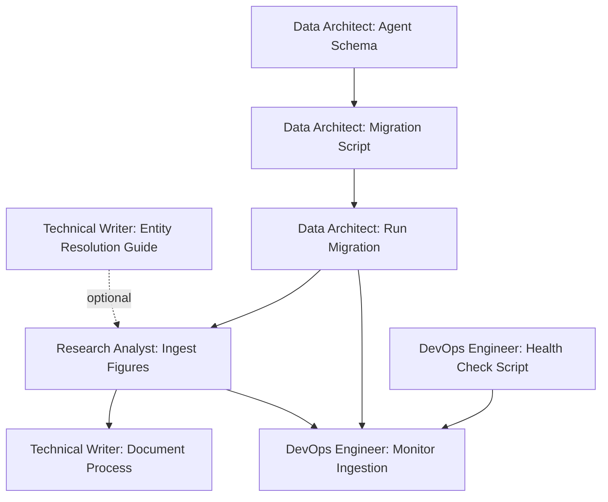

# Fictotum Agent Collaboration Map

## Agent Roster & Primary Responsibilities

### Research Analyst (Data Ingestion Lead)
**Core Competency:** Historical research, data sourcing, bulk ingestion
**Primary Workstreams:**
- Historical figure research and ingestion
- Media work identification and cataloging
- Appearance relationship creation
- Wikidata Q-ID validation

**Key Skills:**
- Neo4j Cypher queries
- Wikidata API integration
- Entity resolution protocol
- Historical accuracy verification

---

### Data Architect (Schema & Backend Lead)
**Core Competency:** Database design, schema evolution, data integrity
**Primary Workstreams:**
- Neo4j schema design and migrations
- API endpoint implementation
- Data quality enforcement
- Performance optimization

**Key Skills:**
- Neo4j schema design
- Python scripting (migrations, utilities)
- API design (Next.js API routes)
- Data modeling

---

### UX Obsessive Designer (Design Lead)
**Core Competency:** Visual design, user experience, design systems
**Primary Workstreams:**
- Design system definition
- Component design and mockups
- User flow optimization
- Accessibility standards

**Key Skills:**
- Tailwind CSS design systems
- Figma/mockup creation
- Design token management
- Typography and color theory

---

### Frontend Polish Specialist (UI Implementation Lead)
**Core Competency:** React/Next.js development, component implementation
**Primary Workstreams:**
- Component implementation from designs
- TypeScript compliance
- Interactive features (search, navigation)
- Performance optimization

**Key Skills:**
- React/Next.js expertise
- TypeScript
- CSS/Tailwind
- Recharts/visualization libraries

---

### Technical Writer (Documentation Lead)
**Core Competency:** Documentation, knowledge management, process design
**Primary Workstreams:**
- API documentation
- Process guides and tutorials
- Agent onboarding materials
- Protocol documentation (CLAUDE.md updates)

**Key Skills:**
- Technical writing
- Markdown documentation
- Process diagramming
- Knowledge architecture

---

### DevOps Infrastructure Engineer (Testing & Reliability Lead)
**Core Competency:** Testing, monitoring, infrastructure health
**Primary Workstreams:**
- Test suite development
- Database health monitoring
- Build/deployment processes
- Performance monitoring

**Key Skills:**
- Python testing frameworks
- Neo4j administration
- CI/CD pipelines
- Monitoring and alerting

---

### Growth Director (Product Strategy Lead)
**Core Competency:** Product strategy, user acquisition, feature prioritization
**Primary Workstreams:**
- Roadmap planning
- Feature prioritization
- User feedback integration
- Growth experiments

**Key Skills:**
- Product management
- Analytics interpretation
- A/B testing design
- User research

---

### Chief Marketing Officer (Positioning & Launch Lead)
**Core Competency:** Marketing strategy, positioning, launch campaigns
**Primary Workstreams:**
- Brand messaging
- Launch planning
- Content marketing
- Community building

**Key Skills:**
- Brand strategy
- Content creation
- Social media marketing
- Launch campaign design

---

## Collaboration Patterns

### Phase 1 (UX Polish) - Completed
```
UX Obsessive Designer → Frontend Polish Specialist
    ↓
Technical Writer (documents completed work)
```

**Pattern:** Sequential handoff (design → implementation → documentation)
**Dependencies:** None critical
**Outcome:** Worked well, no blockers

---

### Phase 2 (Data Quality) - Current Sprint
```
Data Architect (schema + migration)
    ↓
Research Analyst (validates with real ingestion)
    ↓
Technical Writer (documents protocol)

DevOps Engineer (monitors in parallel)
```

**Pattern:** Critical path with parallel monitoring
**Dependencies:**
- Research Analyst blocked until migration completes
- Technical Writer needs session notes from Research Analyst

**Coordination Needs:**
- Data Architect posts migration completion in STATUS_BOARD.md
- Research Analyst shares session notes after 25+ figure ingestion

---

### Future: Multi-Workstream Parallelism
```
Research Analyst (content growth)
    ‖
Data Architect (performance optimization)
    ‖
Frontend Polish Specialist (new features)
    ‖
UX Obsessive Designer (new designs)
    ↓
Technical Writer (documents all above)
```

**Pattern:** Parallel workstreams converge at documentation
**Risk:** Higher chance of conflicts (schema changes, API changes, UI changes)
**Mitigation:** Daily STATUS_BOARD.md updates, explicit resource locking

---

## Dependency Map (Current Sprint)



**Critical Path:** A → B → C → D → E (8-10 days)
**Parallel Work:** F → G (can start anytime, 2-3 days)
**Optional Enhancement:** H (improves D but not blocking)

---

## Cross-Agent Communication Protocols

### Handoff Protocol (Standard)
When Agent A completes work that Agent B depends on:

1. **Agent A:** Update STATUS_BOARD.md with completion summary
2. **Agent A:** Create handoff note in sprint plan:
   - What was completed
   - Where to find the work (files, commits, PRs)
   - Any caveats or known issues
   - Suggested next steps
3. **Agent B:** Acknowledge receipt and review
4. **Agent B:** Ask clarifying questions if needed
5. **Sprint Coordinator:** Verify handoff and update dependency status

### Conflict Resolution Protocol
When agents discover conflicting work:

1. **Agent:** Post conflict description in STATUS_BOARD.md "Blockers" section
2. **Sprint Coordinator:** Facilitate discussion
3. **Options:**
   - Resequence work (one agent pauses, other completes first)
   - Divide and conquer (split conflicting area into separate domains)
   - Escalate to CEO for architectural decision
4. **Document resolution:** Update sprint plan with decision rationale

### Resource Lock Protocol
When agent needs exclusive access to shared resource:

1. **Agent:** Post claim in STATUS_BOARD.md "Active Claims" section
2. **Include:** Resource name, expected duration, release condition
3. **Other agents:** Check STATUS_BOARD.md before starting conflicting work
4. **Release:** Update STATUS_BOARD.md when lock no longer needed

---

## Agent Pairings (High Synergy)

### Designer + Frontend (Natural Pair)
- UX Obsessive Designer creates mockups/design system
- Frontend Polish Specialist implements in React/Next.js
- **When to pair:** New UI features, design system updates

### Data Architect + Research Analyst (Data Pipeline)
- Data Architect creates schema and APIs
- Research Analyst uses APIs to ingest content
- **When to pair:** New data models, bulk ingestion projects

### DevOps + Data Architect (Quality Assurance)
- DevOps Engineer creates tests and monitoring
- Data Architect implements features with test coverage
- **When to pair:** Schema migrations, performance optimization

### Technical Writer + All Agents (Documentation)
- Technical Writer follows all agents' work
- Documents protocols, APIs, processes as they emerge
- **When to pair:** After major feature completion, during onboarding

---

## Workstream Definitions

### Workstream 1: Data Ingestion
**Agents:** Research Analyst (lead), Data Architect (support)
**Focus:** Growing the knowledge graph with quality data
**Cadence:** Ongoing, 2-3 ingestion sessions per sprint

### Workstream 2: User Experience
**Agents:** UX Obsessive Designer (lead), Frontend Polish Specialist (support)
**Focus:** Improving discovery, navigation, and delight
**Cadence:** 1-2 features per sprint

### Workstream 3: Growth & Marketing
**Agents:** Growth Director (lead), Chief Marketing Officer (support)
**Focus:** User acquisition, retention, positioning
**Cadence:** Strategic planning, campaigns around launches

### Workstream 4: Infrastructure
**Agents:** DevOps Infrastructure Engineer (lead), Data Architect (support)
**Focus:** Reliability, performance, monitoring
**Cadence:** Continuous, with spikes around migrations

### Workstream 5: Documentation
**Agents:** Technical Writer Documentarian (lead), all agents (contributors)
**Focus:** Knowledge capture, onboarding, API docs
**Cadence:** Continuous, follows all other workstreams

---

## Coordination Anti-Patterns (Avoid These)

### Anti-Pattern 1: Silent Dependency
**Problem:** Agent B starts work assuming Agent A completed something, but no handoff happened
**Prevention:** Explicit handoff notes in STATUS_BOARD.md, never assume

### Anti-Pattern 2: Duplicate Work
**Problem:** Two agents implement the same feature because no one claimed it
**Prevention:** Update STATUS_BOARD.md "Currently Active" before starting

### Anti-Pattern 3: Merge Conflict Chaos
**Problem:** Multiple agents edit same files simultaneously, causing Git conflicts
**Prevention:** Resource locking for high-conflict files (e.g., schema.py, Navbar.tsx)

### Anti-Pattern 4: Stale Documentation
**Problem:** Technical Writer documents features based on outdated specs
**Prevention:** Technical Writer reads actual code and tests, not just plans

---

## Success Metrics

### Coordination Health Indicators
- **Handoff Latency:** Time between Agent A completing work and Agent B starting dependent work
  - **Target:** < 24 hours
- **Blocker Duration:** Time from blocker identified to blocker resolved
  - **Target:** < 48 hours
- **Conflict Rate:** Number of merge conflicts per sprint
  - **Target:** < 2 per sprint
- **Documentation Lag:** Time between feature completion and documentation published
  - **Target:** < 1 week

### Sprint Velocity Indicators
- **Committed vs Delivered:** Percentage of committed work completed
  - **Target:** 80-100%
- **Scope Creep:** New work added mid-sprint as percentage of original commitment
  - **Target:** < 20%
- **Agent Utilization:** Percentage of sprint time agents spent blocked
  - **Target:** < 10% blocked time

---

**Last Updated:** February 1, 2026
**Next Review:** After Sprint 1 Retrospective (February 14, 2026)
